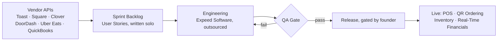
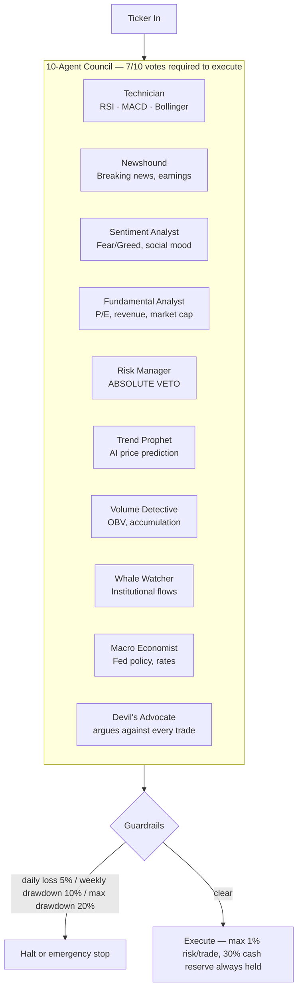
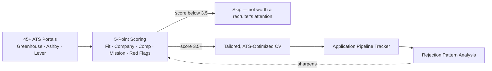
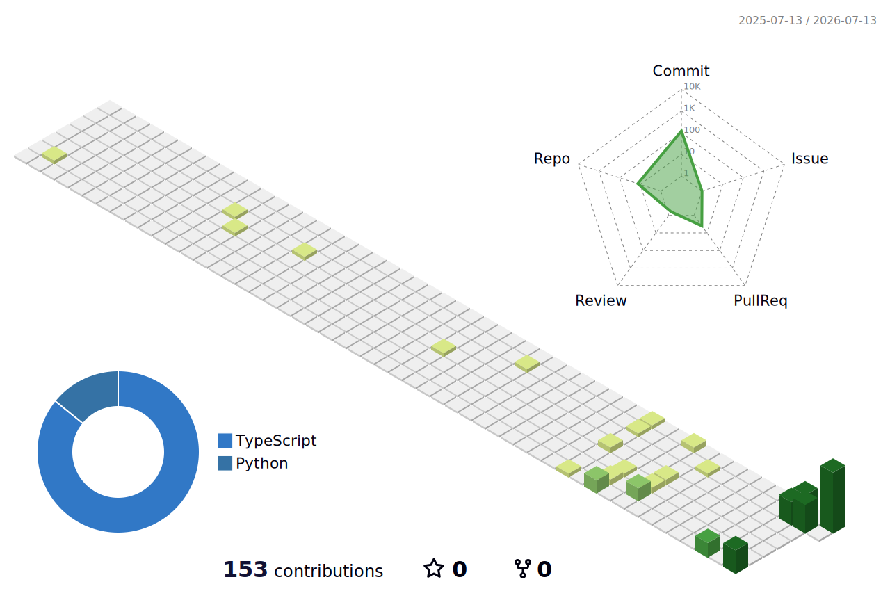

<div align="center">



<a href="https://www.linkedin.com/in/tharunsainandigam/">
  
</a>

<br/>

<a href="https://www.linkedin.com/in/tharunsainandigam/"></a>
<a href="mailto:nandigam2081@gmail.com"></a>
<a href="https://www.kytchenpulse.com/"></a>
<a href="https://sceneswap-web.vercel.app/"></a>


<br/><br/>

<a href="https://github.com/IamTharunsai/IamTharunsai/actions/workflows/snake.yml"></a>
<a href="https://github.com/IamTharunsai/IamTharunsai/actions/workflows/profile-3d-contrib.yml"></a>
<sub><i>this profile is a running system, not a static page — the badges above prove the automation is actually alive</i></sub>

</div>

<br/>

<div align="center">

<a href="#impact-not-activity">Impact</a> ·
<a href="#currently-building">Building</a> ·
<a href="#system-architecture">Architecture</a> ·
<a href="#tech-stack">Stack</a> ·
<a href="#live-metrics">Live Metrics</a>

</div>

<br/>

## `whoami`

```yaml
role: Project Coordinator @ Atlassian  ·  Founder @ KytchenPulse
background: 4+ years — cloud SaaS delivery, enterprise ops, AI product development
education: MS Computer Science (AI focus) — Wright State University, GPA 3.5
credential: Certified ScrumMaster® (CSM), Scrum Alliance
philosophy: "Readiness is a muscle, not a milestone. Refusal beats motivation."
```

> 365 days ago — a Google Slide, a name I made up, and 5 failed startups behind me.
> No product. No team. No funding. Borrowed desk, one problem I couldn't stop
> thinking about. Twelve months later: a live MVP, a $6,000 grant won after 6 rejections,
> and a company registered in Ohio.

I run VP-level cloud delivery at Atlassian and a solo-founder SaaS company at the same time —
and hold both to the identical standard. At Atlassian, scope changes go through a change log,
every delay gets a root cause, every handoff has an owner. I run KytchenPulse the same way, even
when I'm the only person in the room: I coordinated 3 vendors, a $25K budget, and 200+ Figma
screens to zero missed milestones — with no manager above me and no team below me.

I've been the founder, so I know exactly what it costs when coordination breaks.
I've shipped a real product — POS, QR ordering, inventory, real-time financials, live.
I've built Agile from scratch, not inherited someone else's process.
I think in systems, not spreadsheets — I build AI pipelines to do the boring parts of judgment at scale.
No co-founder. No safety net. Five failed startups before this one worked. I don't stop.

<br/>

## Impact, Not Activity

<div align="center">

| Where | What Moved |
|:--|:--:|
| On-time release execution — **Atlassian** | **+15%** |
| Coordination gaps eliminated — **Atlassian** | **−18%** |
| Reporting turnaround — **Atlassian / KytchenPulse** | **−20%** |
| Schedule slippage across 6 vendor API integrations — **KytchenPulse** | **−15%** |
| Execution visibility across plant operations — **Adani Power** | **+22%** |
| Manual reporting effort — **BHEL** | **−21%** |
| Pitch competitions before the win | **6 rejections → 1 win** |
| Funding raised, solo, pre-product | **$6,000** |

</div>

<div align="center">

<details>
<summary><b>How these numbers were earned</b> — click to expand</summary>
<br/>

At Atlassian: sprint-goal alignment across engineering, QA, and product via Jira dashboards and daily standups
cut last-minute coordination issues, which is where the 15% on-time execution gain and 18% fewer coordination
gaps came from — not headcount, better handoffs. At KytchenPulse: the same discipline applied solo — API
contracts negotiated directly with Toast, Square, Clover, DoorDash, Uber Eats, and QuickBooks, each with its
own security baseline and timeline, tracked the way a 5-person PMO would track them. At Adani Power and BHEL:
KPI dashboards replaced manual reporting, which is the direct mechanism behind the 20–22% visibility gains —
not a soft metric, an hours-saved one.

</details>

</div>

<br/>

## Currently Building

<div align="center">

| Project | What It Actually Is | Status |
|:--|:--|:--:|
| **[KytchenPulse](https://www.kytchenpulse.com/)** | AI-powered restaurant ops SaaS — POS, QR ordering, inventory, real-time financials. Built from a Google Slide to a live MVP; Wright Venture Award winner. | 🟢 Live · Founder |
| **[SceneSwap](https://sceneswap-web.vercel.app/)** | AI product-placement engine that composites real products into creator video. Real Next.js/Turborepo monorepo, 14 production deploys. | 🟢 Live |
| **[ARIA](https://aria-nine-flax.vercel.app/)** | AI voice agent for business — full-stack platform (Next.js, Prisma, Turborepo), 50 production deploys. | 🟢 Live |
| **Founder Circle** | Community platform where founders share ideas and get feedback — auth, threaded comments, admin moderation, MongoDB-backed. | 🔒 Private |
| **APEX TRADER** | A 10-agent council (Technician, Newshound, Sentiment, Fundamentals, Risk Manager, Trend Prophet, Volume, Whale Watcher, Macro, Devil's Advocate) votes 7/10 to clear a trade — Risk Manager holds absolute veto. | 🔒 Private |
| **Autonomous Job Intelligence System** | Scans 45+ ATS portals, scores every role on a 5-point framework, auto-tailors CVs, learns from rejection patterns. | 🔒 Private |

</div>

<br/>

## System Architecture

*Prose says "I think in systems." A rendered diagram proves it. These are GitHub-native — no images, no third-party service, just Mermaid in the markdown, live-rendered by GitHub itself.*

**KytchenPulse — how a solo founder ships without a manager above or below him**



<details>
<summary><b>APEX TRADER</b> — 10-agent council, private system — click to expand</summary>
<br/>

*Real architecture, pulled straight from the repo — not marketing copy.*



Risk Manager can veto any trade alone. Devil's Advocate can soft-block. Built to say **NO** more than it says **YES**.

</details>

<details>
<summary><b>Autonomous Job Intelligence System</b> — private system — click to expand</summary>
<br/>



Quality over quantity — a well-targeted application to 5 companies beats a generic blast to 50.

</details>

<br/>

## Tech Stack

**Delivery & Program Management**


**Cloud & DevOps**


**Engineering & AI**


**Data & Reporting**


<br/>

## Live Metrics

<sub>The two cards below are community-run services that occasionally pause under load — if a card looks blank, refresh in a few minutes, it comes back.</sub>

<div align="center">


</div>

<br/>

### 3D Contribution Calendar

<div align="center">

<picture>
  <source media="(prefers-color-scheme: dark)" srcset="profile-3d-contrib/profile-night-rainbow.svg">
  <source media="(prefers-color-scheme: light)" srcset="profile-3d-contrib/profile-green-animate.svg">
  
</picture>

<sub>Auto-regenerated daily by GitHub Actions — appears after the first workflow run (see setup steps)</sub>

</div>

<br/>

### The Streak, Visualized

<div align="center">

<picture>
  <source media="(prefers-color-scheme: dark)" srcset="https://raw.githubusercontent.com/IamTharunsai/IamTharunsai/output/github-contribution-grid-snake-dark.svg">
  <source media="(prefers-color-scheme: light)" srcset="https://raw.githubusercontent.com/IamTharunsai/IamTharunsai/output/github-contribution-grid-snake.svg">
  
</picture>

<sub>Refreshes automatically every 12 hours — this is what "reflect ongoing work" looks like</sub>

</div>

<br/>

### Trophy Case

<div align="center">


</div>

<br/>

### Activity, Weekly

<div align="center">


</div>

<br/>

<div align="center">

### Roles I'm building toward

**Technical Program Manager · Associate Project Manager · Founding Ops · Product / Release Coordinator**

If you're building something real and need someone who can hold it all together — [let's talk](mailto:nandigam2081@gmail.com).


</div>
